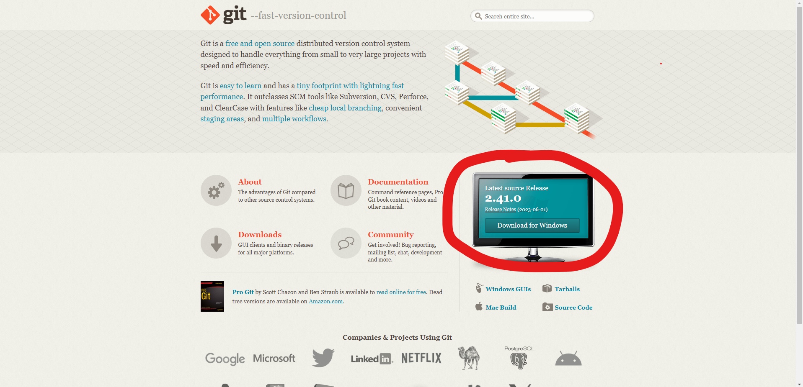
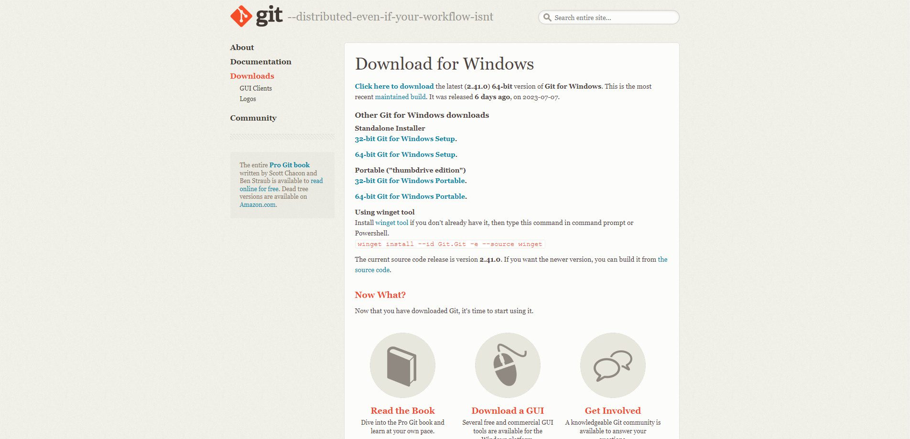
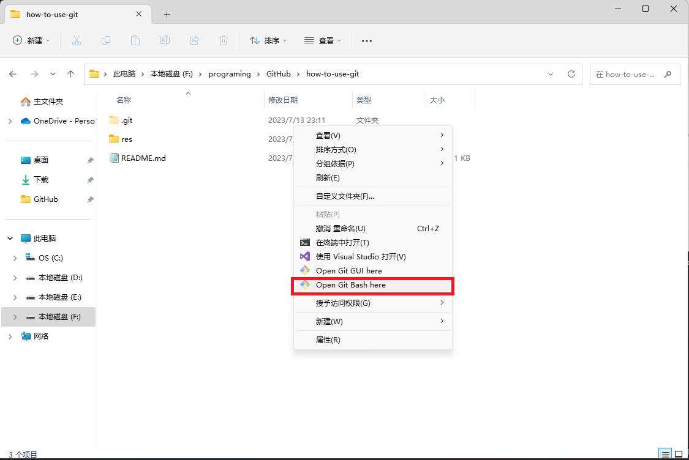
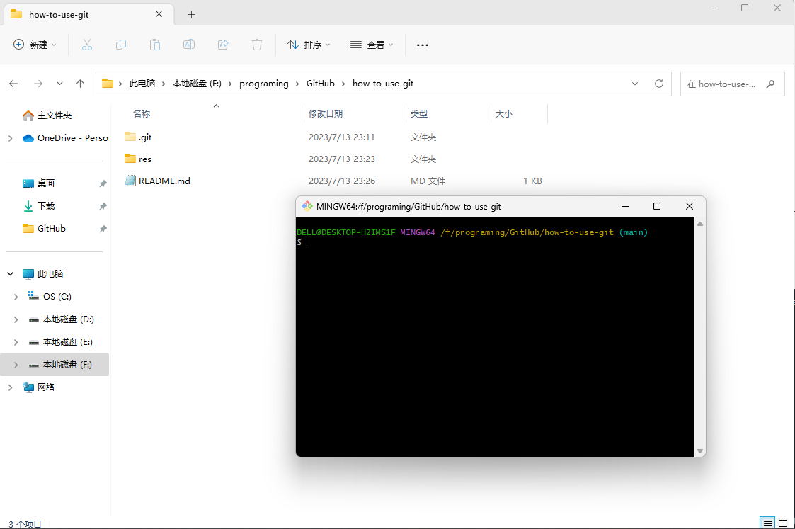
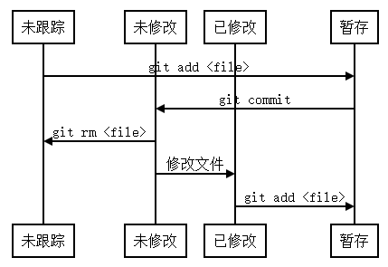
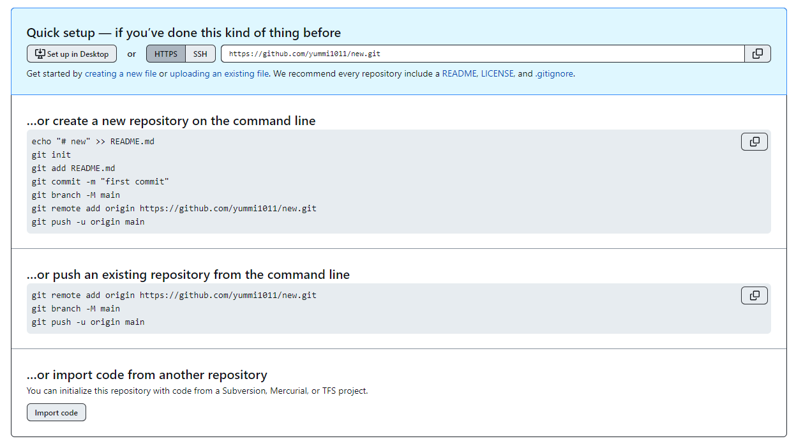

# <center>How-to-use-git</center>

## 1 安装git<br>
* #### 登录git官网 https://git-scm.com/<br>
<br>
* #### 选择并下载对应的版本<br>
<br>
* #### 安装<br>
* 
## 2 开始使用git<br>
### 2.1 使用git bash<br>
* #### 在目标文件夹，右键-->显示更多选项(win11)-->Open Git Bash Here<br>
<br>
* #### 打开成功<br>
<br>
### 2.2 在vscode中使用git<br>

## 3 git 使用方法<br>
### 3.1 个人信息配置<br>
```
$ git config --global user.name <username> # 设置用户名
$ git config --global user.email <usermail> # 设置用户信箱
# 用户名与信箱无需真实存在
$ git config --global -l # 查看用户信息
```
### 3.2 创建本地仓库<br>
```
$ git init # 初始化一个空仓库
```
```
$ git clone <url> # 拷贝别人的仓库
```
### 3.3 文件状态 --> `git add` 和 `git commit`<br>
## 省流：
```
$ git add .
$ git commit -m ""
# 就这么搞就完事了
```
#### 非省流：
仓库内的文件共有四个状态，<b>未跟踪</b>，<b>未修改</b>，<b>已修改</b>，<b>暂存</b>。
其文件转换状态图大致如下。<br>
<br>
* 当新建一个仓库，或向仓库添加一个新的文件时，这个文件会以<b>`未跟踪 <Untracked files>`</b>状态存在。
* 当对仓库内的文件进行修改后，文件类型会变为<b>`已修改 <Changes not staged for commit>`</b>状态。
* 我们首先需要使用<b>`"git add <file>"`</b>或<b>`"git add ."`</b>（点代表当前目录及其子目录内全部文件），使这两种类型的文件，变成<b>`暂存 <Changes to be committed>`</b>状态。

通过<b>`"git status"`</b>命令查看仓库状态：
```
$ git status    # 查看仓库状态
----------------- 以下为返回信息 -------------------------------------------
On branch main
Your branch is up to date with 'origin/main'.

Changes to be committed:    # 暂存的文件
  (use "git restore --staged <file>..." to unstage)
        new file:   gitadd.txt

Changes not staged for commit:  # 已修改的文件
  (use "git add <file>..." to update what will be committed)
  (use "git restore <file>..." to discard changes in working directory)
        modified:   README.md

Untracked files:    # 未追踪的文件
  (use "git add <file>..." to include in what will be committed)
        newfile.txt
---------------------------------------------------------------------------
# 一般情况懂点英语都可以看懂什么意思
```

当文件都成为<b>`暂存 <Changes to be committed>`</b>状态后，我们就可以使用<b>`"git commit -m "<update notes>"`</b>提交了。所有的文件也都会变成未修改状态。

<b>`"git log"`</b> 可以查看所有的提交历史。<b>`"git reset head~ --soft"`</b>可以撤销上一次提交。
```
& git log                       # 查看提交记录
commit 9b26f8a111af2cb509a4b8269b42b23289a54769 (HEAD -> main, origin/main)
Author: sunlin <123@163.com>
Date:   Fri Jul 14 00:34:34 2023 +0800

    update README.md

commit d25b1dd69e6c31e07b3830d95ce4cf4b9c5a8d02
Author: sunlin <zbsl1@163.com>
Date:   Thu Jul 13 23:30:18 2023 +0800

    update
.....
$ git reset head~ --soft        # 撤销上一次提交
$ git log                       # 查看提交记录
commit d25b1dd69e6c31e07b3830d95ce4cf4b9c5a8d02 (HEAD -> main)
Author: sunlin <zbsl1@163.com>
Date:   Thu Jul 13 23:30:18 2023 +0800

    update
...
```
很明显可以看出，最近的一次提交被撤销了，同时文件状态也变成了提交前的状态。<br>

### 3.4 链接远程仓库 GitHub
## 省流：
废话不多说，直接看GitHub官方教程。<br>
<br>

### 说实话，到这里就真真完全够用了。
## 因为这个教程就是这么push上来的。

